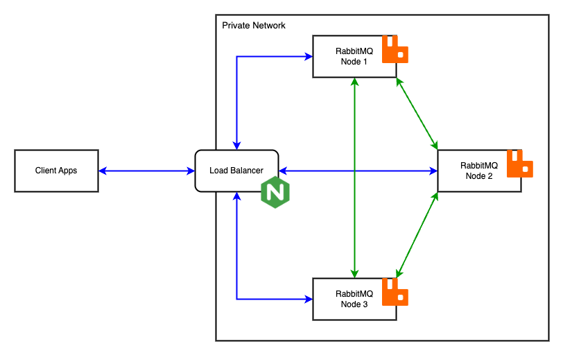

# RabbitMQ Cluster

## High Level Architecture


## Menjalankan RabbitMQ
Membuat dan menjalankan **Load Balancer** dan **Node RabbitMQ**.
```bash
docker compose up -d
```
> Pastikan Anda sudah menginstal docker engine dan docker compose
>
>

Port yang terbuka:

- Port 5672: AMQP protocol
- Port 15672: RabbitMQ management (http://localhost:15672)

Default username `hello` dan password `yourpassword`, default file konfigurasi dapat Anda temukan di `./config/rabbitmq.conf`. 

## Membuat Cluster
Node RabbitMQ yang berjalan masih belum terkonfigurasi sebagai cluster, disini kita akan membuat cluster baru (tanpa data) dengan menggabungkan `rabbit-node2` dan `rabbit-node3` kedalam cluster `rabbit-node1`.
> Patikan nilai environment variable `RABBITMQ_ERLANG_COOKIE` bernilai sama untuk semua node.
>

```bash
# Masuk kedalam container untuk bisa menjalankan RabbitMQ CLI
# docker exec -it <container-name> sh

# On rabbit-node1

rabbitmqctl stop_app
# => Stopping rabbit application on node rabbit@rabbit-node1 ...

rabbitmqctl reset
# => Resetting node rabbit@rabbit-node1 ...

rabbitmqctl start_app
# => Starting node rabbit@rabbit-node1 ...

# On rabbit-node2

rabbitmqctl stop_app
# => Stopping rabbit application on node rabbit@rabbit-node2 ...

rabbitmqctl reset
# => Resetting node rabbit@rabbit-node2 ...

rabbitmqctl join_cluster rabbit@rabbit-node1 # rabbit@rabbit-node1 adalah hostname dari rabbit-node1
# => Clustering node rabbit@rabbit-node2 with rabbit@rabbit-node1

rabbitmqctl start_app
# => Starting node rabbit@rabbit-node2 ...

# On rabbit-node3
# Lakukan step by step seperti rabbit-node2
```

Kita dapat melihat bahwa 3 node tersebut bergabung dalam sebuah cluster dan kita bisa mengecek statusnya dengan command:
```bash
# On rabbit-node1
rabbitmqctl cluster_status
# ...
# => Running Nodes
# => 
# => rabbit@rabbit-node1
# => rabbit@rabbit-node2
# => rabbit@rabbit-node3
# ... done
# 
# Status cluster dapat juga dilihat di rabbit-node2 dan rabbit-node3
```

Membuat queue dengan tipe `quorum` melalui RabbitMQ API
```bash
curl -u hello:yourpassword -XPUT 'http://localhost:15672/api/queues/%2F/test.queue1' \
--header 'Content-Type: application/json' \
--data '{
    "arguments": {
        "x-queue-type": "quorum"
    },
    "durable": true,
    "auto_delete": false
}'
```

Kita dapat melihat hasilnya menggunakan CLI di node RabbitMQ:
```bash
# On rabbit-node3
rabbitmq-queues quorum_status test.queue1
```
Hasilnya queue sudah terbuat dan berhasil tereplikasi ke semua node.
```text
Status of quorum queue test.queue1 on node rabbit@rabbit-node3 ...
┌─────────────────────┬────────────┬────────────┬────────────────┬──────────────┬──────────────┬──────────────┬────────────────┬──────┬─────────────────┐
│ Node Name           │ Raft State │ Membership │ Last Log Index │ Last Written │ Last Applied │ Commit Index │ Snapshot Index │ Term │ Machine Version │
├─────────────────────┼────────────┼────────────┼────────────────┼──────────────┼──────────────┼──────────────┼────────────────┼──────┼─────────────────┤
│ rabbit@rabbit-node1 │ leader     │ voter      │ 2              │ 2            │ 2            │ 2            │ undefined      │ 1    │ 3               │
├─────────────────────┼────────────┼────────────┼────────────────┼──────────────┼──────────────┼──────────────┼────────────────┼──────┼─────────────────┤
│ rabbit@rabbit-node2 │ follower   │ voter      │ 2              │ 2            │ 2            │ 2            │ undefined      │ 1    │ 3               │
├─────────────────────┼────────────┼────────────┼────────────────┼──────────────┼──────────────┼──────────────┼────────────────┼──────┼─────────────────┤
│ rabbit@rabbit-node3 │ follower   │ voter      │ 2              │ 2            │ 2            │ 2            │ undefined      │ 1    │ 3               │
└─────────────────────┴────────────┴────────────┴────────────────┴──────────────┴──────────────┴──────────────┴────────────────┴──────┴─────────────────┘
```

## Menghapus Node Dari Cluster
Menghapus node dalam cluster dapat dilakukan secara langsung dari node atau melalui node lain dalam cluster, berikut step by step menghapus node dalam cluster secara langsung.
```bash
# On rabbit-node3

rabbitmqctl stop_app
# => Stopping rabbit application on node rabbit@rabbit-node3 ...

rabbitmqctl reset
# => Resetting node rabbit@rabbit-node3 ...

rabbitmqctl start_app
# => Starting node rabbit@rabbit-node3 ...

rabbitmqctl cluster_status
# ...
# => Running Nodes
# => 
# => rabbit@rabbit-node3
# ... done

# On rabbit-node2

rabbitmqctl cluster_status
# ...
# => Running Nodes
# => 
# => rabbit@rabbit-node1
# => rabbit@rabbit-node2
# ... done
```

Ketika node yang akan dihapus tidak dapat diakses (offline)
```bash
# On rabbitmq-node2

rabbitmqctl cluster_status --formatter erlang
# => Cluster status of node rabbit@rabbit-node2 ...
# => [{nodes,
# =>    [{disc,
# =>      ['rabbit@rabbit-node1','rabbit@rabbit-node2',
# =>       'rabbit@rabbit-node3']}]},
# => {running_nodes,['rabbit@rabbit-node1','rabbit@rabbit-node2']},
# ... done

rabbitmqctl forget_cluster_node rabbit@rabbit-node3
# => Removing node rabbit@rabbit-node3 from the cluster

rabbitmqctl cluster_status --formatter erlang
# => Cluster status of node rabbit@rabbit-node2 ...
# => [{nodes,[{disc,['rabbit@rabbit-node1','rabbit@rabbit-node2']}]},
# =>  {running_nodes,['rabbit@rabbit-node1','rabbit@rabbit-node2']},
# ... done
```

## Menambahkan Node Dalam Cluster
Menambahkan node baru kedalam cluster seperti halnya step-by-step membuat cluster dimana node baru akan direset terlebih dahulu dan ditambahkan kedalam cluster. Yang membuat berbeda ketika kita memiliki queue dengan tipe quorum yang terdapat step tambahan untuk menambahkan replika ke node baru.

Menambahkan node baru ke dalam cluster
```bash
# On rabbit-node3

rabbitmqctl stop_app
# => Stopping rabbit application on node rabbit@rabbit-node3 ...

rabbitmqctl reset
# => Resetting node rabbit@rabbit-node3 ...

rabbitmqctl join_cluster rabbit@rabbit-node1
# => Clustering node rabbit@rabbit-node3 with rabbit@rabbit-node1

rabbitmqctl start_app
# => Starting node rabbit@rabbit-node3 ...

rabbitmqctl cluster_status --formatter erlang
# => Cluster status of node rabbit@rabbit-node3 ...
# => [{nodes,
# =>      [{disc,
# =>           ['rabbit@rabbit-node1','rabbit@rabbit-node2',
# =>            'rabbit@rabbit-node3']}]},
# =>  {running_nodes,
# =>      ['rabbit@rabbit-node1','rabbit@rabbit-node2','rabbit@rabbit-node3']},
# ... done

rabbitmqctl list_queues
# => Listing queues for vhost / ...
# => [[{name,<<"test.queue1">>},{messages,0}]]

rabbitmq-queues quorum_status test.queue1
# => Status of quorum queue test.queue1 on node rabbit@rabbit-node3 ...
# => ┌─────────────────────┬────────────┬────────────┬────────────────┬─────┐
# => │ Node Name           │ Raft State │ Membership │ Last Log Index │ ... │
# => ├─────────────────────┼────────────┼────────────┼────────────────┼─────|
# => │ rabbit@rabbit-node1 │ leader     │ voter      │ 3              │ ... |
# => ├─────────────────────┼────────────┼────────────┼────────────────┼─────|
# => │ rabbit@rabbit-node2 │ follower   │ voter      │ 3              │ ... |
# => └─────────────────────┴────────────┴────────────┴────────────────┴─────┘
```

Dapat kita lihat queue `test.queue1` dapat diproses di node 3 (publish atau consume message) akan tetapi node 3 tidak memiliki replikasi queue tersebut, yang membuat ketika salah satu dari node 1 atau node 2 down maka state dari queue tersebut berubah menjadi `minority` dan proses publish akan ditolak (nack) dan consume message akan berhenti.

Untuk menyelesaikannya kita perlu secara eksplisit mereplikasi queue kedalam node baru.
```bash
# On rabbit-node1

rabbitmq-queues grow rabbit@rabbit-node3 --errors-only all
# => Growing all quorum queues on rabbit@rabbit-node3...

rabbitmq-queues quorum_status test.queue1
# => Status of quorum queue test.queue1 on node rabbit@rabbit-node3 ...
# => ┌─────────────────────┬────────────┬────────────┬────────────────┬─────┐
# => │ Node Name           │ Raft State │ Membership │ Last Log Index │ ... │
# => ├─────────────────────┼────────────┼────────────┼────────────────┼─────|
# => │ rabbit@rabbit-node1 │ leader     │ voter      │ 31             │ ... |
# => ├─────────────────────┼────────────┼────────────┼────────────────┼─────|
# => │ rabbit@rabbit-node2 │ follower   │ voter      │ 31             │ ... |
# => ├─────────────────────┼────────────┼────────────┼────────────────┼─────|
# => │ rabbit@rabbit-node3 │ follower   │ voter      │ 31             │ ... |
# => └─────────────────────┴────────────┴────────────┴────────────────┴─────┘
```

## Menyeimbangkan Queues
Ketika RabbitMQ berjalan dalam mode cluster, queue yang dibuat akan menunjuk salah satu node menjadi Queue Leader atau Queue Master (tergantung jenis queue) yang akan bertanggung jawab untuk proses replikasi data dll. Ketika Queue Leader penyebarannya tidak merata akan membuat ketimpangan dalam penggunaan sumber daya dan dapat menyebabkan bottleneck, untuk menyeimbangkannya kita bisa menjalankan perintah berikut.
```bash
# On rabbit-node3

rabbitmqctl list_queues --formatter pretty_table name leader messages
# => Listing queues for vhost / ...
# => ┌─────────────┬─────────────────────┬──────────┐
# => │ name        │ leader              │ messages │
# => ├─────────────┼─────────────────────┼──────────┤
# => │ test.queue1 │ rabbit@rabbit-node1 │ 0        │
# => ├─────────────┼─────────────────────┼──────────┤
# => │ test.queue3 │ rabbit@rabbit-node1 │ 0        │
# => ├─────────────┼─────────────────────┼──────────┤
# => │ test.queue2 │ rabbit@rabbit-node1 │ 0        │
# => └─────────────┴─────────────────────┴──────────┘

rabbitmq-queues rebalance quorum
# => Re-balancing leaders of quorum queues...
# => ┌─────────────────────┬─────────────────────────┐
# => │ Node name           │ Number of quorum queues │
# => ├─────────────────────┼─────────────────────────┤
# => │ rabbit@rabbit-node3 │ 1                       │
# => ├─────────────────────┼─────────────────────────┤
# => │ rabbit@rabbit-node1 │ 1                       │
# => ├─────────────────────┼─────────────────────────┤
# => │ rabbit@rabbit-node2 │ 1                       │
# => └─────────────────────┴─────────────────────────┘

rabbitmqctl list_queues --formatter pretty_table name leader messages
# => Listing queues for vhost / ...
# => ┌─────────────┬─────────────────────┬──────────┐
# => │ name        │ leader              │ messages │
# => ├─────────────┼─────────────────────┼──────────┤
# => │ test.queue2 │ rabbit@rabbit-node3 │ 0        │
# => ├─────────────┼─────────────────────┼──────────┤
# => │ test.queue3 │ rabbit@rabbit-node2 │ 0        │
# => ├─────────────┼─────────────────────┼──────────┤
# => │ test.queue1 │ rabbit@rabbit-node1 │ 0        │
# => └─────────────┴─────────────────────┴──────────┘
```
